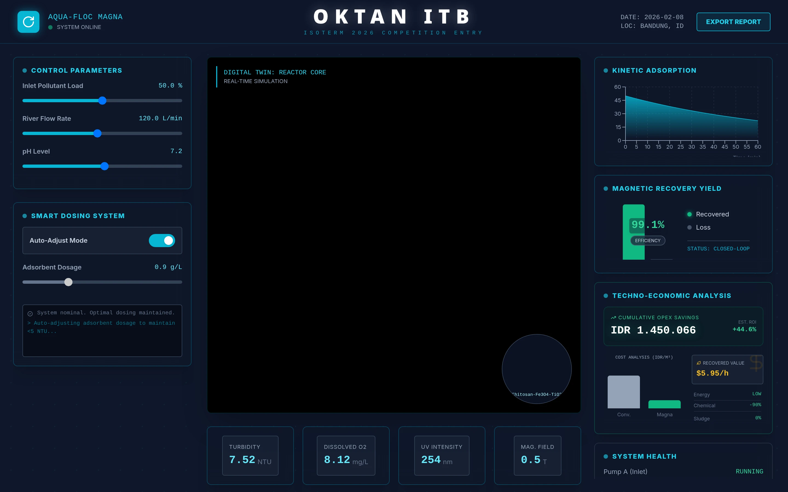

# AQUA-FLOC MAGNA 🌊

**Advanced Water Treatment Digital Twin & Smart Control System**



> **ISOTERM 2026 Competition Entry**  
> Developed by **OKTAN ITB**

## 🚀 Overview

**AQUA-FLOC MAGNA** is a cutting-edge web-based simulator and digital twin for industrial water treatment processes. It integrates high-fidelity 3D visualization with real-time physics simulation to monitor and optimize the coagulation-flocculation process using magnetic adsorbents.

This platform serves as both a **control interface** and an **educational tool**, demonstrating how smart IoT systems can autonomously regulate dosage to maintain water quality standards while maximizing economic efficiency.

## ✨ Key Features

### 🧠 Smart Dosing System
- **Autonomous Regulation**: Dynamic PID-based control loop that adjusts adsorbent dosage based on incoming pollutant loads.
- **Real-time Simulation**: Simulates chemical interactions, turbidity reduction, and recovery rates.
- **IoT Alert Log**: Mimics sensor feedback and system alerts for high contamination events.

### 🌐 3D Digital Twin
- **Interactive Visualization**: Powered by **Three.js (React Three Fiber)**, offering a visual representation of the treatment tank, magnetic drum separator, and fluid dynamics.
- **Live Data Overlay**: See operational status of pumps, filters, and magnetic separators proportional to real-time data.

### 📊 Analytics & Economics
- **Performance Metrics**: Monitor critical parameters like Turbidity (NTU), Dissolved Oxygen (DO), pH, and UV Intensity.
- **Economic Impact**: Real-time calculation of operational costs vs. savings from recovered water.
- **Data Export**: Generate instant PDF reports for on-site analysis.

## 🛠️ Technology Stack

- **Frontend Framework**: [React 19](https://react.dev/) + [Vite](https://vitejs.dev/)
- **Styling**: [Tailwind CSS](https://tailwindcss.com/)
- **3D Graphics**: [Three.js](https://threejs.org/) & [React Three Fiber](https://docs.pmnd.rs/react-three-fiber)
- **Animations**: [Framer Motion](https://www.framer.com/motion/)
- **Icons**: [Lucide React](https://lucide.dev/)
- **Charts**: [Recharts](https://recharts.org/)

## 🏁 Getting Started

### Prerequisites
- Node.js (v18 or higher)
- npm or yarn

### Installation

1. **Clone the repository**
   ```bash
   git clone https://github.com/dzakyzahy/AQUA-FLOQ-MAGNA.git
   cd AQUA-FLOQ-MAGNA
   ```

2. **Install dependencies**
   ```bash
   npm install
   ```

3. **Run the development server**
   ```bash
   npm run dev
   ```

4. **Open in Browser**
   Navigate to `http://localhost:5173` (or the port shown in your terminal).

## 📄 License

This project is licensed under the MIT License - see the [LICENSE](LICENSE) file for details.

---

<div align="center">
  <sub>Built with 💙 by zahy for OKTAN ITB ISOTERM 2026</sub>
</div>
